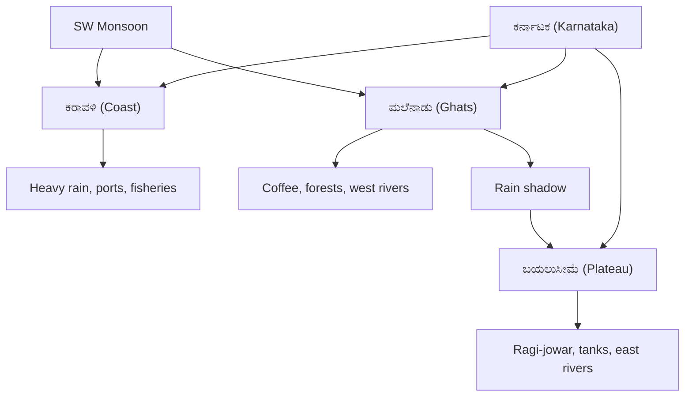

> [!tip] Exam Focus
> Geography gives 8–10 questions, and **Karnataka-specific geography is the highest-yield half**: districts and their rivers/soils/crops, Western Ghats passes and peaks, and the Krishna–Kaveri–Tungabhadra–Malaprabha river systems. Nationally, expect monsoon mechanism, soils, and one map-based question (Tropic of Cancer states, longest coastline state, or major ports).

## 1. Physical Geography of India (ಭಾರತದ ಭೌತಿಕ ಭೂಗೋಳ)

- **Physiographic divisions:** (1) Himalayan mountains (ಹಿಮಾಲಯ), (2) Northern plains (ಉತ್ತರದ ಮೈದಾನ), (3) Peninsular plateau (ದಖ್ಖನ್ ಪ್ರಸ್ಥಭೂಮಿ — Karnataka sits here), (4) Coastal plains, (5) Islands.
- **Tropic of Cancer (ಕರ್ಕಾಟಕ ಸಂಕ್ರಾಂತಿ ವೃತ್ತ, 23.5°N)** passes through 8 states: Gujarat, Rajasthan, MP, Chhattisgarh, Jharkhand, West Bengal, Tripura, Mizoram. Mnemonic: "**ಗು–ರಾ–ಮ–ಛ–ಝಾ–ಬಂ–ತ್ರಿ–ಮಿ**".
- **Monsoon (ಮಾನ್ಸೂನ್):** South-West monsoon (June–Sept, ~75% of rain, Arabian Sea + Bay of Bengal branches) and North-East/retreating monsoon (Oct–Dec, Tamil Nadu coast). Karnataka gets most rain from the SW branch on the coast and Malnad, least in the rain-shadow east.
- **Major rivers (national):** Ganga system (Ganga–Yamuna–Ghaghara), Indus system, Brahmaputra; peninsular east-flowing (Godavari, Krishna, Kaveri, Mahanadi — form deltas) vs west-flowing (Narmada, Tapi — form estuaries, flow through rift valleys).

## 2. Karnataka Geography (ಕರ್ನಾಟಕ ಭೂಗೋಳ)

- **Location and extent:** 11.5°N–18.5°N, 74°E–78.5°E; area ~1.91 lakh sq km (largest in South India after undivided AP); capital Bengaluru; **31 districts** ( memorise new ones: Vijayanagara/Hosapete, Kalaburagi division additions).
- **Three natural divisions:** (1) **Karavali (ಕರಾವಳಿ)** — narrow coast, heavy rain, ports (Mangaluru/New Mangalore, Karwar); (2) **Malnad (ಮಲೆನಾಡು)** — Western Ghats (ಪಶ್ಚಿಮ ಘಟ್ಟಗಳು), coffee/tea/spices, peaks Mullayanagiri (highest, Chikkamagaluru), Kudremukh, Tadiandamol; (3) **Maidan/Bayaluseeme (ಬಯಲುಸೀಮೆ)** — Deccan plateau, black/red soils, ragi–jowar–pulses belt.
- **Rivers of Karnataka:**

| River (ನದಿ)             | Origin                                  | Districts / flow            | Joins              | Key dam / project                   |
| ----------------------- | --------------------------------------- | --------------------------- | ------------------ | ----------------------------------- |
| Krishna (ಕೃಷ್ಣಾ)        | Mahabaleshwar (MH)                      | North Karnataka border belt | Bay of Bengal      | Almatti, Narayanpur                 |
| Kaveri (ಕಾವೇರಿ)         | Talakaveri, Kodagu                      | Kodagu–Mysuru–Mandya        | Bay of Bengal (TN) | KRS (Krishnaraja Sagar)             |
| Tungabhadra (ತುಂಗಭದ್ರಾ) | Tunga+Bhadra meet at Koodli, Shivamogga | Central Karnataka           | Krishna            | Tungabhadra dam (Hospete)           |
| Malaprabha (ಮಲಪ್ರಭಾ)    | Kanakumbi, Belagavi                     | North Karnataka             | Krishna            | Naviluteertha/Renuka Sagar          |
| Sharavati (ಶರಾವತಿ)      | Ambuteertha, Shivamogga                 | West-flowing                | Arabian Sea        | Linganamakki; Jog Falls (ಜೋಗ ಜಲಪಾತ) |
| Netravati (ನೇತ್ರಾವತಿ)   | Kudremukh                               | Dakshina Kannada            | Arabian Sea        | Drinking water for Mangaluru        |
| Kali (ಕಾಳಿ)             | Supa, Uttara Kannada                    | West-flowing                | Arabian Sea        | Supa/Kadra/Kodasalli hydel chain    |

- **Soils (ಮಣ್ಣು):** black/regur (ಕಪ್ಪು — Deccan trap north, cotton/sunflower), red (ಕೆಂಪು — Maidan, ragi/groundnut), laterite (laterite/ಜೇಡಿ — Malnad/coast, cashew/coffee), alluvial (ಮೆಕ್ಕಲು — river valleys, paddy/sugarcane), coastal sandy.
- **Climate and crops:** tropical monsoon; coast >3000 mm rain, Bayaluseeme <700 mm. Kharif (ಮುಂಗಾರು: paddy, maize, cotton, sugarcane), Rabi (ಹಿಂಗಾರು: jowar, wheat, Bengal gram), plantation (coffee in Kodagu/Chikkamagaluru — Karnataka is India's top coffee state; areca, pepper, cardamom).

*Reading the diagram:* the SW monsoon strikes the coast and the Ghats first (heavy rain → ports, forests, coffee, west-flowing rivers); by the time air crosses the hills it is dry, so the plateau is a **rain shadow** of tanks, millets, and east-flowing rivers. Every "which crop/soil/district" MCQ is answered by placing the district in one of the three boxes.

## Likely Questions / PYQ

1. Highest peak of Karnataka? — (a) Mullayanagiri ✔ (b) Kudremukh (c) Tadiandamol (d) Bababudangiri
2. Jog Falls is on which river? — (a) Sharavati ✔ (b) Netravati (c) Kali (d) Kaveri
3. KRS dam is built across? — (a) Kaveri ✔ (b) Krishna (c) Tungabhadra (d) Hemavati
4. Tunga and Bhadra meet at? — (a) Koodli ✔ (b) Sangam (c) Hampi (d) Kaginele
5. Black soil is best suited for? — (a) Cotton ✔ (b) Tea (c) Coffee (d) Coconut
6. Coffee capital district of Karnataka? — (a) Kodagu/Chikkamagaluru ✔ (b) Mandya (c) Raichur (d) Ballari
7. Tropic of Cancer does NOT pass through? — (a) Maharashtra ✔ (b) Gujarat (c) Mizoram (d) Tripura
8. Number of districts in Karnataka (2026)? — (a) 31 ✔ (b) 27 (c) 30 (d) 28

## Quick Revision

> [!abstract] 60-second revision
> - 3 divisions: ಕರಾವಳಿ (ports/rain) → ಮಲೆನಾಡು (coffee/Ghats) → ಬಯಲುಸೀಮೆ (millets/rain shadow)
> - 4 exam rivers: Krishna (Almatti), Kaveri (KRS), Tungabhadra (Hospete), Malaprabha (Naviluteertha) + west rivers Sharavati (Jog), Kali, Netravati
> - Soils: ಕಪ್ಪು=cotton, ಕೆಂಪು=ragi, ಜೇಡಿ/laterite=coffee/cashew, ಮೆಕ್ಕಲು=paddy
> - Monsoon: SW June–Sept (~75%); Mullayanagiri = highest peak; 31 districts

## Related notes

[[02_History]] · [[04_Polity]] · [[05_Economy]] · [[06_General_Science]] · [[02_Syllabus_and_Pattern]]
