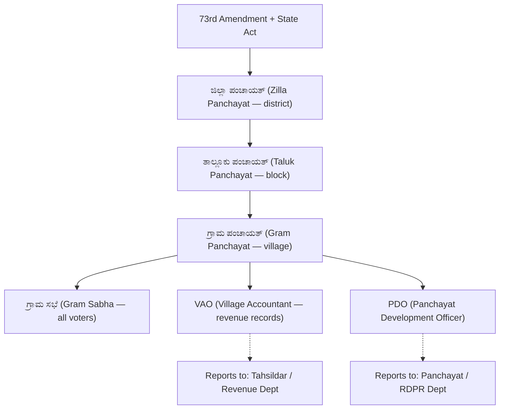

> [!tip] Exam Focus
> Polity is the **most VAO-relevant subject after Kannada**. Weightage splits roughly: Constitution basics (Preamble, FRs, DPSP, Duties — 3–4 Qs), Union/State organs (2 Qs), and **Panchayati Raj + VAO duties (4–6 Qs — the section that decides selection)**. Learn the 73rd Amendment cold: tiers, reservations, terms, and who the VAO reports to.

## 1. The Constitution (ಸಂವಿಧಾನ)

- **Preamble (ಪ್ರಸ್ತಾವನೆ):** Justice, Liberty, Equality, Fraternity; "Sovereign Socialist Secular Democratic Republic". Mnemonic: "**J–L–E–F** = ನ್ಯಾಯ–ಸ್ವಾತಂತ್ರ್ಯ–ಸಮಾನತೆ–ಭ್ರಾತೃತ್ವ". 42nd Amendment (1976) added Socialist, Secular, Integrity.
- **Fundamental Rights (ಮೂಲಭೂತ ಹಕ್ಕುಗಳು, Arts 12–35):** Right to Equality (14–18), Freedom (19–22), against Exploitation (23–24), Religion (25–28), Cultural/Educational (29–30), Constitutional Remedies (32 — "heart and soul", Ambedkar).
- **DPSP (ನಿರ್ದೇಶಕ ತತ್ವಗಳು, Arts 36–51):** non-justiciable guidance — panchayats (Art 40), uniform civil code (44), free legal aid (39A). FR vs DPSP distinction is a favourite MCQ.
- **Fundamental Duties (ಮೂಲಭೂತ ಕರ್ತವ್ಯಗಳು, Art 51A):** 11 duties (86th Amendment added education duty); non-justiciable.
- **Organs:** Parliament (Lok Sabha 543 elected + Rajya Sabha; money bill starts in Lok Sabha), President (head of state), PM + Council of Ministers, Supreme Court (Art 32 writs) and High Courts (Art 226 writs — wider than SC).

## 2. Panchayati Raj — 73rd Amendment (ಪಂಚಾಯತ್ ರಾಜ್, 1992/1993)

The constitutional core of village administration: Part IX (Arts 243–243O), Eleventh Schedule (29 subjects), three-tier system, 5-year term, State Election Commission + State Finance Commission, **33% women reservation (Karnataka raised it to 50%)**, SC/ST reservation by population.

*Reading the chart:* authority flows downward (district → block → village → all voters in the Gram Sabha), while the two village officers split sideways — the **VAO handles land/revenue records** for the Revenue Department, the **PDO handles development works** for RDPR. Exam trap: the VAO is NOT under the PDO; both serve the Gram Panchayat but report up different chains.

| Tier | Kannada name | Head | Key function |
|---|---|---|---|
| District | ಜಿಲ್ಲಾ ಪಂಚಾಯತ್ | President (ಅಧ್ಯಕ್ಷರು) | District planning, consolidates block plans |
| Block | ತಾಲ್ಲೂಕು ಪಂಚಾಯತ್ | President | Coordinates Gram Panchayats, block schemes |
| Village | ಗ್ರಾಮ ಪಂಚಾಯತ್ | Adhyaksha/Sarpanch | Water, sanitation, streetlights, local taxes, records |
| Base | ಗ್ರಾಮ ಸಭೆ | All registered voters | Must meet ≥2 times/year; approves plans, social audit |

## 3. Role of the VAO (ಗ್ರಾಮ ಲೆಕ್ಕಾಧಿಕಾರಿಯ ಪಾತ್ರ)

- **Land records:** maintain Record of Rights (RTC/ಪಹಣಿ), mutation entries (ಪರಿವರ್ತನೆ), survey numbers, crop details; issue income/caste/domicile certificates based on records.
- **Revenue collection:** land revenue demand and collection, reporting encroachments and crop loss for relief.
- **Village administration:** births/deaths registration support, election duties (rolls, polling), census/survey assistance, disaster reporting to Tahsildar.
- **Chain of command:** VAO → Revenue Inspector → Tahsildar (ತಹಶೀಲ್ದಾರ್) → Assistant Commissioner → Deputy Commissioner (ಜಿಲ್ಲಾಧಿಕಾರಿ). Karnataka local governance runs this revenue chain **parallel** to the panchayat chain (EO → CEO-ZP).

**Mnemonics:** tiers bottom-up "**ಗ್ರಾ–ತಾ–ಜಿ**" (Gram–Taluk–Zilla). Amendment "**73 = ಪಂಚಾಯತ್, 74 = ಪುರಸಭೆ**" (rural vs urban). FRs "**ಸಮ–ಸ್ವಾ–ಶೋ–ಧ–ಸಾಂ–ಪರಿಹಾರ**" (Equality, Freedom, Exploitation, Religion, Culture, Remedies).

## Likely Questions / PYQ

1. Panchayati Raj inserted by which amendment? — (a) 73rd ✔ (b) 42nd (c) 44th (d) 74th
2. Minimum women reservation under 73rd Amendment (base)? — (a) 33% ✔ (b) 50% (c) 25% (d) 10%
3. Term of a Panchayat? — (a) 5 years ✔ (b) 6 (c) 4 (d) 3
4. Gram Sabha consists of? — (a) All registered voters of the village ✔ (b) Elected members only (c) VAO+PDO (d) MLA+MP
5. VAO maintains which record? — (a) RTC/Pahani ✔ (b) Passport (c) Court decree (d) Bank ledger
6. VAO's immediate supervising officer? — (a) Revenue Inspector ✔ (b) PDO (c) CEO-ZP (d) SP
7. Article 40 directs the state to organise? — (a) Village Panchayats ✔ (b) Municipalities (c) Courts (d) Universities

## Quick Revision

> [!abstract] 60-second revision
> - Preamble J–L–E–F; FRs 12–35 (32 = remedies); DPSP non-justiciable (Art 40 = panchayats); Duties 51A (11)
> - 73rd = rural 3 tiers (ಗ್ರಾ–ತಾ–ಜಿ), 5-yr term, 33% women (Karnataka 50%), 11th Schedule 29 subjects
> - VAO = RTC/mutation/certificates/revenue; reports RI → Tahsildar → AC → DC; parallel to PDO/RDPR chain

## Related notes

[[01_Kannada_Grammar]] · [[03_Geography]] · [[05_Economy]] · [[02_Syllabus_and_Pattern]] · [[02_History]]
