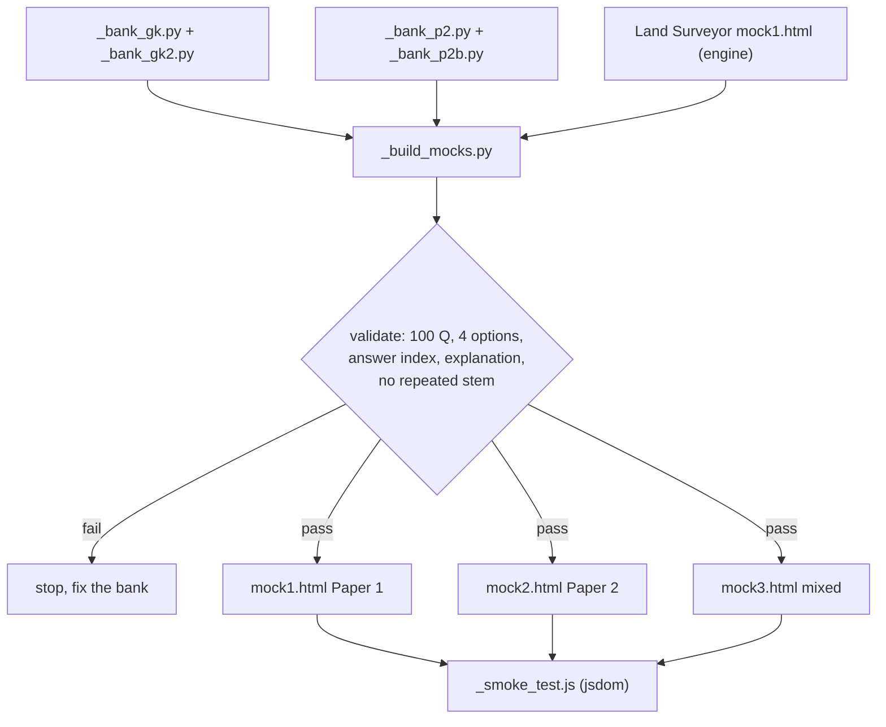

# Mock Test Build Notes — KEA Karnataka VAO 2026

> [!focus] Verified pattern these mocks follow
> Read from the official KEA VAO 2026 notification (`07_Agent_Log/_pdf_pages/VAO_p05.png`) and re-confirmed against the KEA recruitment page `https://cetonline.karnataka.gov.in/kea/vaorpc2026` on **2026-09-30**.
>
> | | Paper 1 | Paper 2 |
> |---|---|---|
> | Date | **04.10.2026** | 04.10.2026 |
> | Time | 10:30–12:30 | 14:30–16:30 |
> | Questions | 100 | 100 |
> | Marks | 100 | 100 |
> | Duration | 120 min | 120 min |
> | Options | 4 + 5th "not answered" circle | 4 + 5th "not answered" circle |
> | Negative | 0.25 per wrong **and** 0.25 if no circle is shaded | same |
> | Extra time | 10 min after the bell to shade the 5th circle | same |
> | Minimum | 35% in each paper | 35% in each paper |
>
> Paper 2's three subjects carry **100 questions / 100 marks / 2 hours in total** — that is all the
> notification publishes. It does **not** state a sub-split. The **35 Kannada / 35 English / 30
> Computer** weighting used here is the standard "Communication" Paper 2 allocation used across
> Karnataka Government recruitment (the same split appears in KPSC syllabi for that paper). It is a
> derived study weighting, not a published one — see `../02_Syllabus_and_Pattern.md` for the full
> note.

## 1. What is in this folder

| File | What it is |
|---|---|
| `mock1.html` | **Paper 1 — General Knowledge.** 100 Q / 100 marks / 120 min. |
| `mock2.html` | **Paper 2 — Kannada + English + Computer Knowledge.** 100 Q / 100 marks / 120 min. |
| `mock3.html` | **Mixed revision paper.** GK 50 + Kannada 20 + English 15 + Computer 15. |
| `_build_mocks.py` | Generator — rebuilds all three HTML files from the question banks. |
| `_bank_gk.py`, `_bank_gk2.py` | Paper 1 question pools (main + supplementary). |
| `_bank_p2.py`, `_bank_p2b.py` | Paper 2 question pools (main + supplementary). |
| `_smoke_test.js` | Headless jsdom test that drives each mock end to end. |
| `mock_test_notes.md` | This file. |

## 2. How the mocks were built

The exam engine was **not** rewritten. It is reused verbatim from the Land Surveyor kit
(`LandSurveyor/ClaudeCode/06_Mock_Tests/mock1.html`), which was already audited. Only the data
block, the section table, the headings and the `localStorage` keys are substituted. So both kits'
mocks behave identically — same timer, same palette, same scoring, same review.

`_build_mocks.py` reads that template, parses the question banks, validates them, and writes the
three HTML files. Nothing in the engine's own code is touched, so a bug cannot be introduced by
hand-editing HTML.



The generator refuses to write anything if a paper does not come to exactly 100 questions, if any
question has fewer than four options, a duplicate option, an out-of-range answer index, a missing
explanation, or a repeated question stem. mock3 is additionally checked to be **disjoint** from
mock1 and mock2 — no question is repeated across the three papers.

## 3. Question distribution

### mock1 — Paper 1, General Knowledge (100 Q)

| Section | Qs | Covers |
|---|---|---|
| Indian History (with Karnataka) | 20 | Ancient, medieval, modern; Karnataka dynasties; freedom struggle |
| Indian & Karnataka Geography | 15 | Rivers, soils, climate, districts, dams |
| Indian Constitution & Polity | 25 | Constitution, FRs, DPSP, amendments, Panchayati Raj |
| Economy & Rural Development | 15 | Basic economics, agriculture, welfare schemes, rural development |
| Everyday Science | 10 | Physics, chemistry, biology, environment |
| Current Events | 15 | Karnataka governance, schemes, appointments, ISRO, sports |

These six sections map onto the notification's official Paper 1 sub-areas (current events, everyday
science, Constitution, history, geography, state & district administration, rural development and
co-operation, Karnataka environment) — see `../02_Syllabus_and_Pattern.md`.

### mock2 — Paper 2 (100 Q)

The notification names three subjects and gives one total; it publishes no sub-split. The split below
is the standard Communication-Paper 2 weighting (see the callout above).

| Section | Qs | Derived weight |
|---|---|---|
| (ಎ) General Kannada | 35 | 35 marks |
| (ಬಿ) General English | 35 | 35 marks |
| (ಸಿ) Computer Knowledge | 30 | 30 marks |

### mock3 — Mixed revision (100 Q)

| Section | Qs |
|---|---|
| General Knowledge | 50 |
| General Kannada | 20 |
| General English | 15 |
| Computer Knowledge | 15 |

mock3 draws its 50 GK questions from the parts of the GK banks that mock1 did not use, plus a
supplementary pool written for it. Its Kannada set likewise uses the unused tail of the Kannada bank
plus a supplementary Kannada pool. **Zero questions repeat across the three papers** — the generator
fails the build if any do.

## 4. Question labels — read this before trusting an answer key

Every question carries a label that is shown on screen and again in the answer review.

| Label | Meaning |
|---|---|
| **PYQ-style** | The *topic* recurs in past Karnataka PSC / KEA recruitment papers. The exact wording is ours — this is **not** a verbatim reproduction of an official paper. |
| **expected** | Compiled from the standard PSC/KEA syllabus and typical coaching question sets. Not independently fact-checked. |

> [!warning] The answer keys are compiled, not certified
> These questions were written from standard GK, Kannada-grammar, English-grammar and
> computer-literacy material. **No official KEA answer key was used**, because no VAO 2024/2025
> question paper with key was retrieved and parsed. Treat every key as a strong study answer, not as
> an authority. Before the exam, cross-check anything you are unsure of against the official papers
> listed in `../05_Resources/resources.md`.

## 5. Features in each HTML file

| Feature | Status |
|---|---|
| Welcome screen with exam specs and the section table | ✅ |
| Countdown timer 120:00 → 00:00, auto-submit at zero | ✅ |
| Colour-coded question palette (not-visited / unanswered / attempted / marked) | ✅ |
| Mark-for-review checkbox | ✅ |
| Section tabs, each showing its own question count | ✅ |
| Progress bar and attempted / marked / unattempted counters | ✅ |
| Manual submit with a confirmation modal | ✅ |
| Scored result: total, percentage, Correct / Wrong / Unattempted / Penalty tiles | ✅ |
| **Per-section breakdown table** (questions, correct, wrong, skipped, marks) | ✅ |
| Answer review with the correct option, your pick, and an explanation for every question | ✅ |
| `localStorage` persistence — reload without losing answers | ✅ |
| Fully offline: no external scripts, styles, fonts or images | ✅ |
| Keyboard navigation — ← → between questions, 1–4 to answer | ✅ |

> [!warning] One deliberate difference from the real OMR
> The notification deducts **0.25 for a wrong answer AND a further 0.25 for a question with no
> circle shaded at all**. The 5th "not answered" circle exists precisely so a deliberate blank is not
> penalised. These mocks score an unattempted question as **0**, so they do not train blind guessing.
> On the real OMR you **must shade the 5th circle for anything you skip**, or you lose 0.25 anyway.
> The welcome screen of each mock says this too.

## 6. How to run them

1. Open `mock1.html` in any modern browser (Chrome, Edge, Firefox, Safari). No internet needed.
2. Click **Start Test** — the timer starts at 120:00:00 and counts down.
3. Move between sections with the tabs; use the palette to jump to any question.
4. Tick **Mark for review** on anything you want to come back to.
5. Submit manually, or let it auto-submit at 00:00:00.
6. Read the score, the per-section breakdown, then **Review Answers**.
7. **Retake Test** clears the saved answers and restarts.

Sit mock1 and mock2 under real conditions — one sitting each, no notes. Use mock3 as the day-before
revision paper.

## 7. Reproducing and re-verifying

```bash
# rebuild all three HTML files from the question banks
python _build_mocks.py

# drive each mock headlessly and assert the whole flow works
NODE_PATH="<global node_modules>" node _smoke_test.js
```

`_build_mocks.py` fails loudly rather than writing a broken paper. `_smoke_test.js` opens each mock in
jsdom, starts it, answers the first 30 questions (20 right, 10 wrong), marks one for review, submits,
and asserts: 100 questions loaded and sectioned, a tab per section with the right count, a 100-button
palette, the confirmation modal, the per-section breakdown rows, Correct/Wrong/Unattempted/Penalty
tiles, the penalty arithmetic (2.50) and the score (17.50), the review's correct/your-answer flags and
explanations, the timer format, and that no external asset is referenced.

**Last run: 2026-09-30 — all checks passed** for mock1, mock2 and mock3 (and for the three Land
Surveyor mocks, which share the same engine).

## 8. Known gaps

1. **No verbatim PYQs.** The official KEA VAO 2024 papers exist on the KEA site and are linked from
   `../05_Resources/resources.md`, but they are scanned Kannada PDFs that could not be parsed into
   text in this run, so no question was copied from them. Every question here is ours, labelled
   `PYQ-style` or `expected` accordingly. Nothing is claimed as "asked in year X".
2. **Answer keys are not official.** See the warning in §4.
3. **Current-events questions age quickly.** Anything in the Current Events section should be
   re-checked against a monthly magazine before the exam.
4. **Kannada and English sections are grammar-heavy.** That mirrors the paper, but if the actual
   paper weights comprehension more heavily, drill the passage-based questions in
   `../03_Notes/09_General_English.md` and `../03_Notes/01_Kannada_Grammar.md` as well.

---

*Built by: Claude Code agent (Mock Test Engineer role) · Last updated 2026-09-30*
