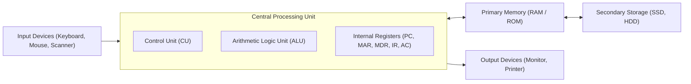

---
tags:
  - cst
  - unit-1
  - fundamentals-of-computer
  - hardware
  - memory-hierarchy
video_id: OvboDQ1Fi44
channel: Statecraft IAS Academy
duration: 1h 03m
language: Kannada
created: 2026-09-05
---

# 🖥️ CST Unit 1: Fundamentals of Computers — Comprehensive Study Guide

> **Source Lecture**: [Computer Teacher Recruitment 2026 | Unit 01 Fundamentals of Computer | CST 2026 Complete Class](https://youtu.be/OvboDQ1Fi44)
> **Faculty**: Statecraft IAS Academy | **Language**: Kannada (ಕನ್ನಡ) | **Duration**: 1h 03m

> [!NOTE] Syllabus Coverage (Unit 1)
> - **Functional Components**: Input, CPU (ALU, CU, Registers), Output, Secondary Storage.
> - **Evolution & Generations**: Vacuum Tubes (1st) → Transistors (2nd) → Integrated Circuits (3rd) → VLSI / Microprocessors (4th) → ULSI / AI & Quantum (5th).
> - **Computer Classification**: Supercomputer, Mainframe, Minicomputer, Microcomputer (Workstations, PCs, Laptops, Embedded).
> - **Memory Hierarchy**: Registers → Cache (L1, L2, L3) → Primary Memory (RAM/ROM) → Secondary Memory (SSD, HDD, Optical, Magnetic Tape).
> - **Motherboard & System Assembly**: Form factors (ATX, micro-ATX), Northbridge/Southbridge architecture, Expansion slots (PCIe), BIOS/UEFI, CMOS battery, SMPS power ratings.

## 🔑 Key Concepts & High-Yield Exam Points

### 1. The Von Neumann Architecture

1. **Stored-Program Concept**: Programs and data reside together in the same memory space.
2. **Instruction Cycle**: `Fetch → Decode → Execute → Store`.
3. **Von Neumann Bottleneck**: Throughput limitation caused by CPU-memory bus sharing.

### 2. Five Generations of Computers — Rapid Matrix

| Generation | Switching Device | Primary Memory | Secondary Storage | Key Languages | Prominent Examples |
| :--- | :--- | :--- | :--- | :--- | :--- |
| **1st (1940-56)** | Vacuum Tubes | Magnetic Drums | Magnetic Tape / Punch cards | Machine Language | ENIAC, EDVAC, UNIVAC I |
| **2nd (1956-63)** | Transistors | Magnetic Core | Magnetic Disks | Assembly, FORTRAN, COBOL | IBM 1401, CDC 1604 |
| **3rd (1964-71)** | Integrated Circuits (SSI/MSI) | Magnetic Core / Semi | Hard Disks | PASCAL, BASIC, C | IBM 360, PDP-8 |
| **4th (1971-Present)** | VLSI / Microprocessors | Semiconductor (RAM/ROM) | Optical Disks, HDD, SSD | C++, Java, Python | IBM PC, Apple Macintosh |
| **5th (Present & Future)** | ULSI, Quantum, Bio-chips | High-density 3D NAND | Cloud, NVMe, Optical | AI/ML, Natural Language | Supercomputers (PARAM, Frontier) |

### 3. Memory Hierarchy & Speed / Cost Tradeoff

1. **CPU Registers**: Fastest (<1 ns), highest cost per bit, smallest capacity (64–512 bytes).
2. **Cache Memory (SRAM)**: Static RAM (flip-flop based, no refreshing needed). L1 (per core), L2 (per core), L3 (shared across cores).
3. **Main Memory (DRAM)**: Dynamic RAM (capacitor + transistor, periodic refresh required). Volatile.
4. **ROM (Non-Volatile)**: Mask ROM, PROM, EPROM (UV light erase), EEPROM (electrical erase), Flash Memory.
5. **Secondary & Tertiary Storage**: SSD (NAND flash, fast seek, no moving parts), HDD (magnetic platters), Optical (CD/DVD/Blu-ray), Magnetic Tape (long-term archive).

### 4. Motherboard Components & System Assembly Essentials

- **CPU Socket**: LGA (Land Grid Array - Intel) vs PGA (Pin Grid Array - AMD).
- **Chipset**: Modern chipsets integrate Northbridge (memory/PCIe controller) into the CPU die itself; Southbridge (PCH - Platform Controller Hub) handles USB, SATA, audio, low-speed PCIe.
- **BIOS / UEFI**: Firmware executed on power-on (POST - Power-On Self Test). UEFI supports GPT partition scheme, >2.2TB drives, and Secure Boot.
- **CMOS & Battery**: CR2032 3V coin cell that preserves Real-Time Clock (RTC) and BIOS settings when powered off.
- **SMPS (Switched-Mode Power Supply)**: Converts AC mains (230V) to DC rails (+3.3V, +5V, +12V, -12V). Typical 24-pin ATX power connector.

---
## 📝 Model Practice Questions (Exam-Oriented)

1. *Which memory is directly accessed by the CPU register instructions?* → **Cache / Primary RAM**
2. *Dynamic RAM requires periodic refreshing because:* → **Capacitors leak charge over time**
3. *Which port/bus standard supports hot-swapping and speeds up to 40 Gbps?* → **Thunderbolt 4 / USB4**
4. *The routine performed by BIOS upon system startup is:* → **POST (Power-On Self-Test)**

---
## 🔗 Associated Notes

- [[CST_Computer_Teacher_Study_Resources]] — All 27 CST curated videos
- [[CST_Unit01_Fundamentals_of_Computer_Transcript]] — Lecture transcript
- [[KPSC_CST_2Week_Prep_Plan]] — 14-day study plan
