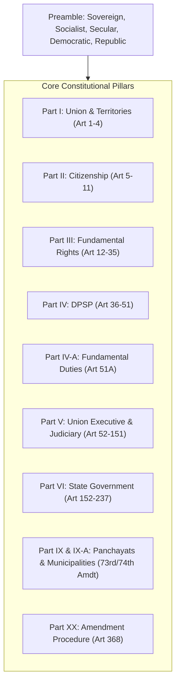

---
tags:
  - polity
  - indian-constitution
  - upsc
  - kpsc
  - gs2
total_videos: 4
created: 2026-09-05
---

# 📜 Indian Polity & Constitution — UPSC & KPSC Core Resources

> [!IMPORTANT] Foundational Anchor for Competitive Exams
> Indian Polity & Constitution is the highest return-on-investment subject for **UPSC Civil Services (Prelims & GS2 Mains)**, **KPSC KAS (Paper 2)**, and **CST Paper 1 (General Studies)**.
> Papa recommended two exhaustive marathon lectures and a dedicated 30-day Essay/Ethics roadmap.

## 📺 Curated Master Lectures

| # | Video Title | Channel | Duration | Language | Primary Exam Utility | Summary & Key Themes | Link |
| :---: | :--- | :--- | :---: | :---: | :--- | :--- | :---: |
| 8 | **KAS 2026 Strategy | Panchajanya IAS | #kas2026 | IAS in Kannada | AKSSA** | Panchajanya IAS (Official)  | 27m 45s | (Kannada) | UPSC / KPSC KAS | KAS 2026 Strategy | Panchajanya IAS | #kas2026 | IAS in Kannada | AKSSA. Recommended by Papa: 'Follow and get books for essay and ethics and plan for 30 days.'. | [Watch Video](https://youtu.be/H45xOUsSKcU) |
| 12 | **Indian Constitution | Comprehensive Analyses | 12 Hours Mega Episode | Part 1 | Satish Joga | DCTE** | Vijayi Bhava | 11h 53m 39s | (Kannada) | UPSC / KPSC KAS | 12-hour mega marathon analyzing the entire Indian Constitution comprehensively by Satish Joga (DCTE). | [Watch Video](https://youtu.be/wA2C4Zu-BT8) |
| 46 | **Complete Indian Constitution in Kannada || ಕನ್ನಡದಲ್ಲಿ ಸಂಪೂರ್ಣ ಭಾರತದ ಸಂವಿಧಾನ || #constitution #kpsc** | CLASSIC EDUCATION | 3h 50m 41s | (Kannada) | UPSC / KPSC KAS | 2-hour crash course / fast revision of Complete Indian Constitution in Kannada. | [Watch Video](https://youtu.be/CyQmNKsjisw) |
| 61 | **Complete Indian Constitution in Kannada || ಕನ್ನಡದಲ್ಲಿ ಸಂಪೂರ್ಣ ಭಾರತದ ಸಂವಿಧಾನ || #constitution #kpsc** | CLASSIC EDUCATION | 3h 50m 41s | (Kannada) | UPSC / KPSC KAS | 2-hour crash course / fast revision of Complete Indian Constitution in Kannada. | [Watch Video](https://youtu.be/CyQmNKsjisw) |

---
## 🏛️ Comprehensive Constitutional Framework (Quick Revision)

### Essential Articles for Quick Recall:

- **Fundamental Rights**: Art 14 (Equality before Law), Art 19 (Six Freedoms), Art 21 (Right to Life & Personal Liberty), Art 21A (Right to Education), Art 32 (Constitutional Remedies - *Habeas Corpus, Mandamus, Prohibition, Certiorari, Quo-Warranto*).
- **DPSP**: Art 39A (Free Legal Aid), Art 40 (Village Panchayats), Art 44 (Uniform Civil Code), Art 45 (Early Childhood Care), Art 50 (Separation of Judiciary from Executive).
- **Union & States**: Art 72 (President's Pardoning Power), Art 110 (Money Bills), Art 123 (President's Ordinance Power), Art 143 (Supreme Court Advisory Jurisdiction), Art 280 (Finance Commission), Art 324 (Election Commission), Art 352/356/360 (National, State, Financial Emergencies).

---
## 🔗 Vault Cross-References

- 🔙 [[Master_YouTube_Study_Catalog]]
